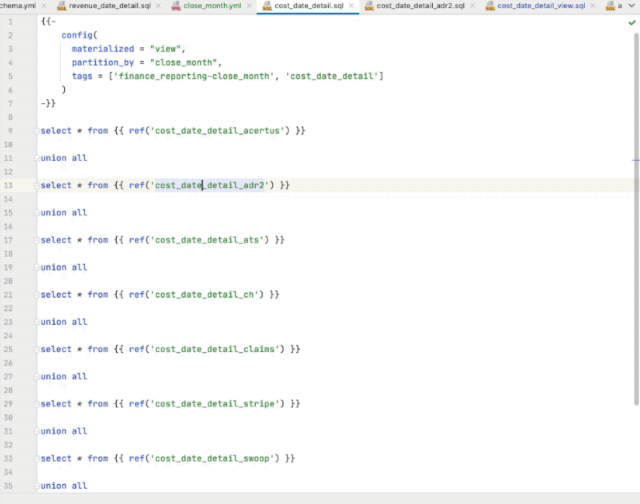

# PyCharm DBT Plugin

<!-- Plugin description -->
PyCharm DBT Plugin is a plugin for PyCharm with the intent of providing a best-in-class experience for developing in [dbt](https://www.getdbt.com).

<!-- Plugin description end -->

## Installation

- Using IDE built-in plugin system:
  
  <kbd>Preferences</kbd> > <kbd>Plugins</kbd> > <kbd>Marketplace</kbd> > <kbd>Search for "pycharm-dbt-plugin"</kbd> >
  <kbd>Install Plugin</kbd>
  
- Manually:

  Download the [latest release](https://github.com/kroo/pycharm-dbt-plugin/releases/latest) and install it manually using
  <kbd>Preferences</kbd> > <kbd>Plugins</kbd> > <kbd>⚙️</kbd> > <kbd>Install plugin from disk...</kbd>

---
Plugin based on the [IntelliJ Platform Plugin Template][template].

[template]: https://github.com/JetBrains/intellij-platform-plugin-template
